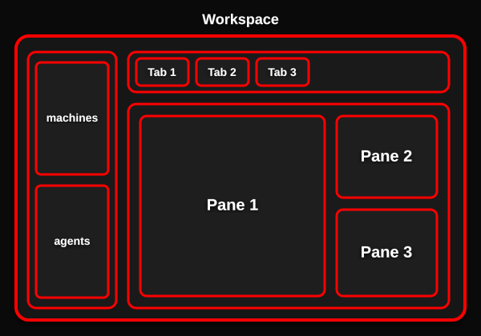

# herdr

## install
```sh
curl -fsSL https://herdr.dev/install.sh | sh
```

## config
The layout of `herdr` is shown as follows:



My key bindings are as follows:

> [!tip]
>
> `<P>`: Prefix (`Ctrl+a`). `<S>`: Shift. `<A>`: Alt. `<T>`: Tab. `<C>`: Ctrl.
>
> `<P>?`: show the keybinds

- `New`

|  keybinds   |      roles      |
| :---------: | :-------------: |
| `<P><S>+g`  | new /worktree/  |
| `<P><S>+n`  | new /workspace/ |
|   `<P>n`    |    new /tab/    |
| `<P>[hjkl]` |   new /pane/    |

- `Move`

|    keybinds    |        roles         |
| :------------: | :------------------: |
| `<A>+<S>+1..9` |  switch /workspace/  |
|  `<A>+<S>+n`   |   next /workspace/   |
|  `<A>+<S>+p`   | previous /workspace/ |
|   `<A>+1..9`   |     switch /tab/     |
|    `<A>+n`     |      next /tab/      |
|    `<A>+p`     |    previous /tab/    |
|  `<A>+[hjkl]`  |    switch /pane/     |
|   `<A>+<T>`    |     next /pane/      |
| `<A>+<S>+<T>`  |   previous /pane/    |

- `Adjust`

|     keybinds     |     roles     |
| :--------------: | :-----------: |
| `<A>+<S>+[hjkl]` | resize /pane/ |

- `Close`

|  keybinds  |       roles       |
| :--------: | :---------------: |
| `<P><S>+d` | close /workspace/ |
| `<P><S>+x` |    close /tab/    |
|   `<P>x`   |   close /pane/    |

