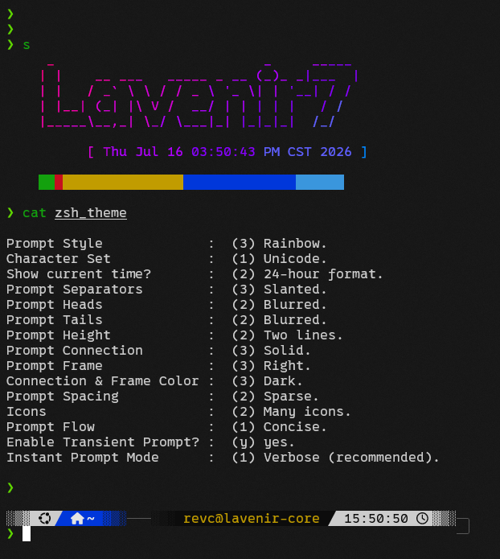

# autoConfig

> [!NOTE]
> 
> 自动安装应用及配置

|script|description|
|:-:|:-:|
|install.sh|安装应用及配置|
|install_apps.sh|安装应用|
|placeConfigFiles.sh|安放配置文件|

## 配置步骤

1. 首先安装应用 (`install_apps.sh`)

    - 必备应用：
        - tmux
        - zsh
        - vim
        - git
        - nodejs

    - 可选应用：
        - yazi
        - superfile
        - getnf
        - glow
        - ruby
        - img2chr
        - wd
        - figlet
        - lolcat
        - sl
        - cowsay

2. 重启终端，使用 getnf 安装字体 (0xProto, FiraMono, SourceCodePro)

2. 然后安放配置文件 (`placeConfigFiles.sh`)

3. 手动操作：
    - `chsh -s $(which zsh)` 或 `chsh -s zsh` 设置 zsh 为默认 shell；

    - 重启终端；

    - 按照提示配置 zsh 主题；

        - 个人 zsh 主题：
            
        
        - 个人 zsh 主题配置：
            

    - `vim` 打开 vim，自动安装 vim 插件；

    - `vim` 打开 vim，输入 `:PlugInstall` 安装 vim-coc 插件；